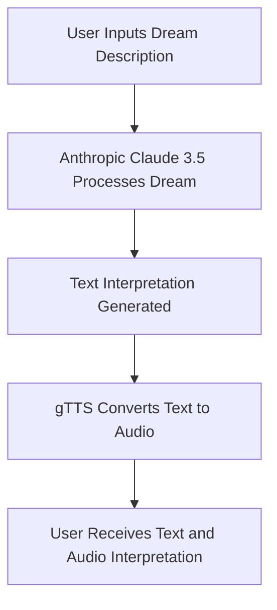

# Dream-Chronicles
Dream Chronicles is an AI-powered app that interprets dreams by transforming user descriptions into insightful text and audio results. It utilizes Anthropic Claude 3.5 for dream analysis and Google Text-to-Speech (gTTS) for audio, providing a personalized dream interpretation experience.

Dream Chronicles is an AI-powered app developed during the "Aspire Pakistan Innovators Hackathon" to help people better understand their dreams. By entering a dream description into the app, users receive a detailed interpretation in both text and audio formats.

## How It Works
- **Dream Analysis:** The app uses the Anthropic Claude 3.5 model, fine-tuned with psychological theories and cultural insights, to interpret your dreams and relate them to shared human experiences.
- **Audio Conversion:** The interpretation is also available as audio, thanks to Google Text-to-Speech (gTTS), making the experience more immersive.

## Technology Stack
- **Frontend:** Streamlit
- **Backend:** Python
- **AI/ML Models:**  
  - **Anthropic Claude 3.5:** For dream interpretation  
  - **gTTS:** For converting text to speech
- **Deployment:** Streamlit
- **Version Control:** Git
- **Project Management:** GitHub Issues, GitHub Projects

## Installation

### Prerequisites
- Python 3.x
- Pip (Python package manager)
- Virtual environment (recommended)

### Steps

1. **Clone the Repository:**
```bash
git clone https://github.com/salmanMaq009/Dream-Chronicles.git
cd dreamchronicles
```

2. **Create a Virtual Environment:**
```bash
python -m venv venv
source venv/bin/activate  # On Windows use `venv\Scripts\activate`
```

3. **Install Dependencies:**
```bash
pip install -r requirements.txt
```

4. **Run the Application:**
```bash
streamlit run app.py
```

### Access the App:

The app will automatically open in your web browser. If not, go to http://localhost:8501 to view it.

## Usage

- **Enter Dream Description:**
Type your dream description into the provided input field.

- **Get Interpretation:**
Click the "Generate" button to receive a detailed analysis in both text and audio.

## Flowchart
Here's a basic overview of how DreamChronicle works:



## Future Enhancements

- **Dream Journals:** Allow users to maintain personalized dream journals with insights and trends.
- **VR Integration:** Explore Virtual Reality (VR) for immersive dream experiences.
- **Advanced Analytics:** Use AI to analyze large datasets, uncovering patterns and deeper insights.

## Team

- **Hamza Saeed:** Team Leader
- **Salman Maqbool**
- **Mohammad Qasim Jamil**
- **Yameen Mohsin**

## Acknowledgments

- **Mentorship:** Zafar Shahid, PhD, Rizwan Ghaffar, and Muhammad Anwar Khan for their guidance.
- **Hackathon Support:** Aspire Pakistan and iCodeGuru for providing the platform to innovate.
